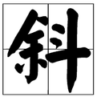

# 链接
 
- 外部连接[百度](http://www.baidu.com)
- 内部链接1 [demo1](demo1.md)
- 内部链接2 当前文本其他部分[代码块](dome.md#代码块-dome)

## 引用式链接
- 外部连接[百度]
- 内部链接1 [demo1]
- 内部链接2 当前文本其他部分[代码块](dome.md#代码块-dome)

# 图片


- 本地



# 引用
>这是一个引方便  

出自<b报名通过后>

多次引用
>>> 多重引文

# 代码块 dome

``` javascript
var a =10;
console.log(a)

```

模压国厅村械栽`var a = 10;` sdfsadfasdfasdfasdf


<!--- 引用式链接  -->

[百度]:http：//www.baidu.com
[demo1]:demo1.md
[代码块]:dome.md#代码块-dome